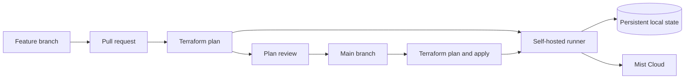
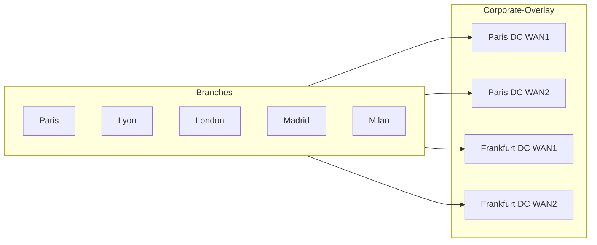

# Mist Terraform GitOps demo

This template repository scaffolds a complete GitOps workflow for the
[Juniper Mist Terraform provider](https://registry.terraform.io/providers/Juniper/mist/latest):

- Mist configuration is reviewed as code.
- Every pull request runs `fmt`, `validate`, and `plan`.
- When supported by the GitHub plan, protected `main` requires approval and a
  successful Terraform check.
- Merging to `main` creates a fresh plan without applying it.
- Apply and destroy are explicit manual operations against `main`.
- Terraform state remains local to a dedicated self-hosted runner.

## Architecture



The workflow serializes all Terraform operations. State is stored under
`~/.local/state/mist-terraform-demo/<owner>-<repository>/terraform.tfstate`,
outside the Actions checkout, so checkout cleanup cannot remove it.

## Managed Mist topology



The WAN configuration creates:

- five branch sites using a shared dual-WAN spoke gateway template;
- Paris and Frankfurt DC sites with dedicated hub gateway profiles;
- a four-path `Corporate-Overlay` hub-and-spoke VPN;
- parameterized branch LAN addressing and DHCP using site variables;
- service policies for branch-to-DC, DC-to-branch, and local internet traffic.

Gateway inventory is intentionally not claimed. Assign real hub gateways to the
two hub profiles and claim branch gateways into their sites when hardware is
available.

> [!IMPORTANT]
> Terraform plans can execute provider code. Run the self-hosted runner in a
> dedicated VM with no host-folder mounts or personal credentials. Only
> same-repository branches created by trusted collaborators are allowed onto
> that runner. Fork pull requests are rejected before their code reaches it.

## Prerequisites

- A repository generated from this GitHub template
- A dedicated VM hosting a repository-scoped GitHub Actions runner
- Terraform 1.15.7 on developer workstations
- A Mist API token with permission to manage the demo organization
- For enforced protections, a second GitHub user who can approve deployments

## 1. Generate the demo repository

```bash
gh repo create OWNER/mist-terraform-demo-private \
  --private \
  --template tmunzer-AIDE/mist-terraform-gitops-demo
```

Template repository settings, secrets, runners, environments, and Terraform
state are intentionally not copied. Configure each generated repository
independently.

GitHub Free does not enforce branch protection or required environment reviewers
for private repositories. Apply and destroy are therefore manual operations;
they never run automatically after a push or merge. A public repository, or a
private repository on GitHub Pro, can additionally enforce the included branch
and environment protections.

## 2. Register the self-hosted runner

In the repository, open **Settings > Actions > Runners > New self-hosted
runner** and follow GitHub's commands from the dedicated VM. Add the custom
label `mist-terraform-demo`, then install the runner as a service so its
working directory and state survive reboots:

```bash
sudo ./svc.sh install actions-runner
sudo ./svc.sh start
sudo ./svc.sh status
```

Run only one runner with this label. The workflow also uses a concurrency group
and Terraform state locking to prevent overlapping plans and applies.

The VM must not mount host directories or contain personal SSH, GitHub, cloud,
or browser credentials. Only outbound network access is required.

To use another persistent state directory, define `TF_STATE_DIR` for the runner
service account. The default is `~/.local/state/mist-terraform-demo`.

## 3. Configure repository protections

Configure pinned Actions and the `mist-production` environment:

```bash
chmod +x scripts/configure-github.sh
./scripts/configure-github.sh OWNER/mist-terraform-demo-private
```

For public repositories or private repositories on GitHub Pro, pass the GitHub
username that must approve runner jobs:

```bash
./scripts/configure-github.sh OWNER/REPOSITORY REVIEWER
```

This additionally requires:

- one approving review, including approval by someone other than the last pusher;
- the trusted-source gate and Terraform status checks to pass;
- all conversations to be resolved;
- linear history, with force pushes and branch deletion disabled.

Repository administrators are also subject to these rules.

The trusted-source gate is defined in the default branch and triggered with
`pull_request_target`. It never checks out or executes fork content. After the
gate approves a same-repository branch, the Terraform job explicitly checks out
that branch's commit. Public or GitHub Pro repositories also wait for approval
of the `mist-production` environment before dispatching to the runner.

## 4. Configure Mist credentials

Create the non-sensitive Mist host as a repository variable:

```bash
gh variable set MIST_HOST \
  --repo OWNER/mist-terraform-demo-private \
  --body "api.mist.com"
```

Create the API token as an encrypted repository secret:

```bash
gh secret set MIST_APITOKEN \
  --repo OWNER/mist-terraform-demo-private \
  --env mist-production
```

The workflow exposes the secret to the provider as `MIST_API_TOKEN`. No
credentials are stored in Terraform files or state.

## 5. Run the demo

Create a branch and make a visible infrastructure change, such as adding a row
to [`data/sites.csv`](data/sites.csv):

```bash
git switch -c add-marseille-site
git add data/sites.csv
git commit -m "Add Marseille demo site"
git push -u origin add-marseille-site
gh pr create --fill
```

1. Open the workflow run and show the Terraform plan in its job summary.
2. Review and approve the pull request with the collaborator account.
3. Merge the pull request and show the fresh `main` plan.
4. Manually apply that revision:

   ```bash
   gh workflow run Terraform \
     --repo OWNER/mist-terraform-demo-private \
     --ref main \
     -f operation=apply
   ```

5. Open the manual workflow run and show the plan followed by apply.
6. Confirm the new site and inherited templates in the Mist UI.

To remove the complete demo, manually dispatch the workflow with
`operation=destroy`. Review the destruction plan before approving the
`mist-production` deployment.

## Local development

Use a separate local state file only for syntax validation. Do not apply from a
developer workstation after the GitHub runner owns the production state.

```bash
terraform init -backend=false
terraform fmt -check -recursive
terraform validate
```

For authenticated experiments that must share the runner's state, run commands
as the runner service account and initialize with the same backend path.

## State operations

The runner creates a timestamped state backup before every apply. Back up the
entire state directory separately if this demo becomes long-lived. Losing the
runner disk means losing Terraform's resource mappings, although resources
remain in Mist and can be imported into a replacement state.

For a multi-runner or production deployment, replace the local backend with HCP
Terraform or another remote backend that provides durable storage and locking.
