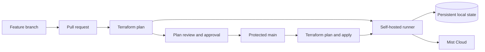

# Mist Terraform GitOps demo

This repository demonstrates a complete GitOps workflow for the
[Juniper Mist Terraform provider](https://registry.terraform.io/providers/Juniper/mist/latest):

- Mist configuration is reviewed as code.
- Every pull request runs `fmt`, `validate`, and `plan`.
- Protected `main` requires an approval and a successful Terraform check.
- Merging to `main` creates a fresh plan and applies that exact saved plan.
- Terraform state remains local to a dedicated self-hosted runner.

## Architecture



The workflow serializes all Terraform operations. State is stored under
`~/.local/state/mist-terraform-demo/<owner>-<repository>/terraform.tfstate`,
outside the Actions checkout, so checkout cleanup cannot remove it.

> [!IMPORTANT]
> Terraform plans can execute provider code. Only same-repository branches
> created by trusted collaborators are allowed onto the self-hosted runner.
> Fork pull requests are rejected before their code reaches the Mac.

## Prerequisites

- A public GitHub repository, or a private repository on GitHub Pro
- A dedicated self-hosted GitHub Actions runner
- Terraform 1.15.7 on developer workstations
- A Mist API token with permission to manage the demo organization
- A second GitHub user or collaborator who can approve pull requests

## 1. Create and push the repository

```bash
git init -b main
git add .
git commit -m "Initial Mist Terraform GitOps demo"
gh repo create OWNER/mist-terraform-gitops-demo \
  --public \
  --source=. \
  --remote=origin \
  --push
```

GitHub Free only provides branch protection for public repositories. This demo
therefore rejects every fork pull request on a GitHub-hosted runner before any
job can reach the self-hosted Mac. Only branches created in the repository by
trusted collaborators can run Terraform.

## 2. Register the self-hosted runner

In the repository, open **Settings > Actions > Runners > New self-hosted
runner** and follow GitHub's commands. Add the custom label
`mist-terraform-demo`, then install the runner as a service so its working
directory and state survive logouts and reboots.

Run only one runner with this label. The workflow also uses a concurrency group
and Terraform state locking to prevent overlapping plans and applies.

To use another persistent state directory, define `TF_STATE_DIR` for the runner
service account. The default is `~/.local/state/mist-terraform-demo`.

## 3. Configure Mist credentials

Create the non-sensitive Mist host as a repository variable:

```bash
gh variable set MIST_HOST --body "api.mist.com"
```

Create the API token as an encrypted repository secret:

```bash
gh secret set MIST_APITOKEN
```

The provider reads these as `MIST_HOST` and `MIST_APITOKEN`. No credentials are
stored in Terraform files or state.

## 4. Protect `main`

After the initial workflow has completed on `main`, apply the included branch
protection:

```bash
chmod +x scripts/configure-github.sh
./scripts/configure-github.sh OWNER/mist-terraform-gitops-demo
```

This requires:

- one approving review, including approval by someone other than the last pusher;
- the trusted-source gate and Terraform status checks to pass;
- all conversations to be resolved;
- linear history, with force pushes and branch deletion disabled.

Repository administrators are also subject to these rules.

The trusted-source gate is defined in the default branch and triggered with
`pull_request_target`. It never checks out or executes fork content. After the
gate approves a same-repository branch, the Terraform job explicitly checks out
that branch's commit.

## 5. Run the demo

Create a branch and make a visible infrastructure change, such as adding a row
to [`data/sites.csv`](data/sites.csv):

```bash
git switch -c add-marseille-site
git add data/sites.csv
git commit -m "Add Marseille demo site"
git push -u origin add-marseille-site
gh pr create --fill
```

1. Open the workflow run and show the Terraform plan in its job summary.
2. Review and approve the pull request with the collaborator account.
3. Merge the pull request.
4. Open the `main` workflow run and show the fresh plan followed by apply.
5. Confirm the new site and inherited templates in the Mist UI.

## Local development

Use a separate local state file only for syntax validation. Do not apply from a
developer workstation after the GitHub runner owns the production state.

```bash
terraform init -backend=false
terraform fmt -check -recursive
terraform validate
```

For authenticated experiments that must share the runner's state, run commands
as the runner service account and initialize with the same backend path.

## State operations

The runner creates a timestamped state backup before every apply. Back up the
entire state directory separately if this demo becomes long-lived. Losing the
runner disk means losing Terraform's resource mappings, although resources
remain in Mist and can be imported into a replacement state.

For a multi-runner or production deployment, replace the local backend with HCP
Terraform or another remote backend that provides durable storage and locking.
